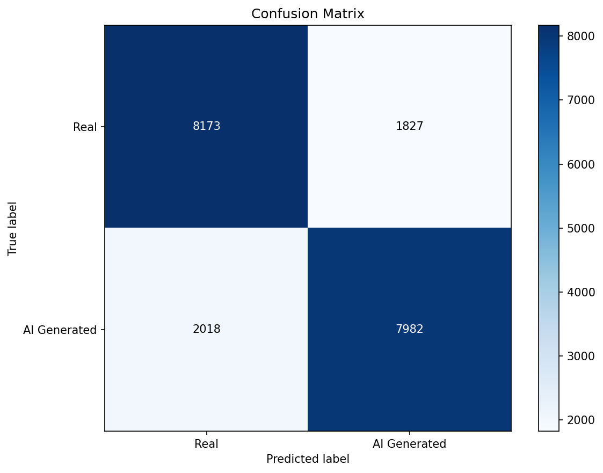
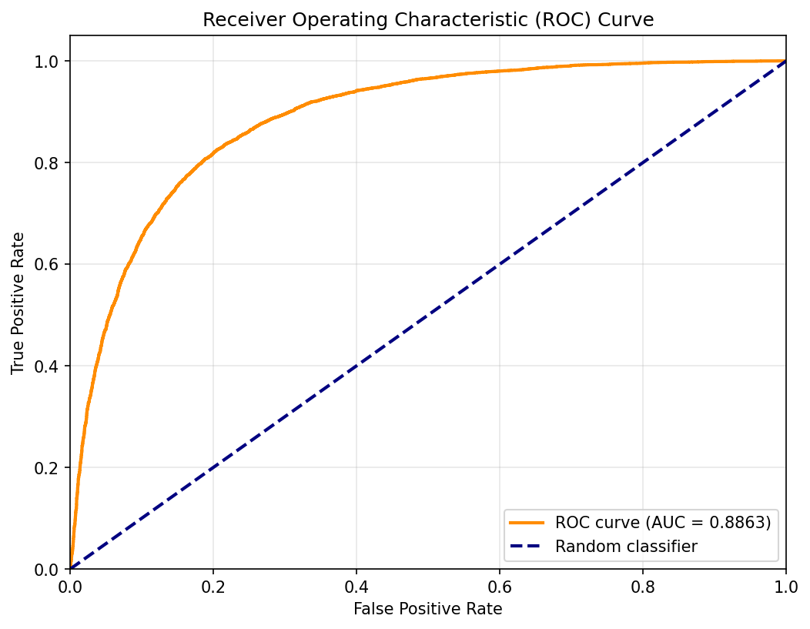
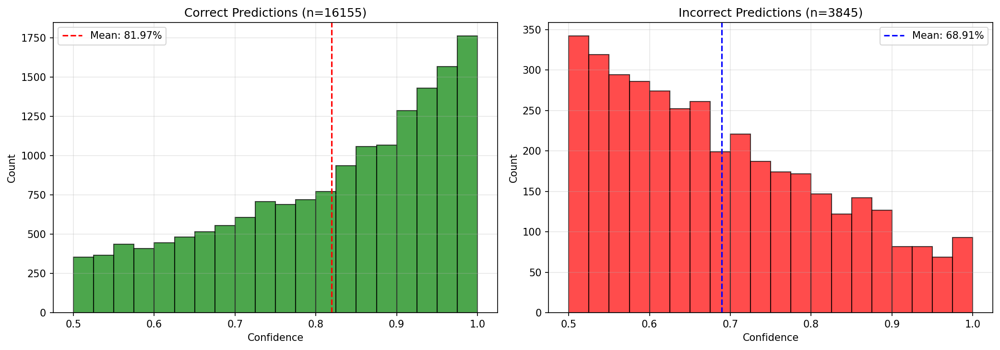

# AI Image Detection using PCA

A Python-based system to detect AI-generated images using Principal Component Analysis (PCA) combined with advanced feature extraction and machine learning.

## Table of Contents

- [How It Works](#how-it-works)
- [Installation](#installation)
- [Kaggle API Setup](#kaggle-api-setup)
- [Dataset Preparation](#dataset-preparation)
- [Usage](#usage)
- [Configuration](#configuration)
- [Project Structure](#project-structure)
- [Performance](#performance)
- [Troubleshooting](#troubleshooting)

## How It Works

The system uses PCA to analyze discriminative features that differ between real photos and AI-generated images:

1. **Feature Extraction**: Extracts frequency domain, noise patterns, statistical, and texture features from images
2. **Dimensionality Reduction**: PCA reduces features to principal components capturing maximum variance
3. **Classification**: A trained classifier (Logistic Regression/SVM/Random Forest) identifies AI vs real images
4. **Detection**: Can classify new images without comparison to reference images

### Why PCA?

- **Pattern Recognition**: Real photos and AI images have different statistical distributions
- **Artifact Detection**: AI generators (DALL-E, Midjourney, Stable Diffusion) leave detectable signatures in frequency and noise patterns
- **Efficiency**: Fast inference once trained (~0.1-0.5 seconds per image)
- **Interpretability**: Can visualize which principal components distinguish AI images

### Features Extracted

1. **Frequency Domain** (DCT/FFT):
   - AI images often have unnatural frequency patterns
   - Analyzes JPEG-like compression artifacts
   - Detects anomalies in the frequency spectrum

2. **Noise Patterns**:
   - Real cameras have sensor-specific noise signatures
   - AI images show more uniform, synthetic noise
   - Local noise variance analysis

3. **Statistical Features**:
   - Color histogram moments (mean, std, skewness, kurtosis)
   - Edge statistics via Sobel operators
   - Distribution analysis across color channels

4. **Texture** (Local Binary Patterns):
   - Captures local texture patterns
   - LBP histograms differ between AI-generated and real images
   - Effective for detecting synthetic texture


## Installation

### Prerequisites
- Python 3.8 or higher
- pip package manager
- 5GB free disk space (for dataset)
- Internet connection (for dataset download)

### Install Dependencies

```bash
pip install -r requirements.txt
```

This installs:
- `numpy` - Numerical computing
- `opencv-python` - Image processing
- `scikit-learn` - PCA and classifiers
- `scikit-image` - Advanced image features (LBP)
- `scipy` - Frequency domain analysis (FFT/DCT)
- `matplotlib` - Visualization and plots
- `pillow` - Image loading
- `kagglehub` - Kaggle dataset downloads
- `tqdm` - Progress bars
- `joblib` - Model serialization

### Verify Installation

```bash
python -c "import cv2, sklearn, skimage; print('All packages installed successfully!')"
```

## Kaggle API Setup

The easiest way to get the CIFAKE dataset is through automatic download using Kaggle's API.

### Step 1: Create a Kaggle Account

1. Visit [kaggle.com](https://www.kaggle.com)
2. Click "Register" and create a free account
3. Verify your email address

### Step 2: Generate API Token

1. Log in to Kaggle
2. Click on your profile picture (top right) → **Account**
3. Scroll down to the **API** section
4. Click **"Create New API Token"**
5. This downloads a file called `kaggle.json`

### Step 3: Install API Credentials

Place the `kaggle.json` file in the correct location:

**Windows:**
```
C:\Users\<YourUsername>\.kaggle\kaggle.json
```

**Linux/Mac:**
```
~/.kaggle/kaggle.json
```

**Manual steps:**

**Windows (PowerShell):**
```powershell
# Create .kaggle directory
New-Item -Path "$env:USERPROFILE\.kaggle" -ItemType Directory -Force

# Move kaggle.json (adjust path to where you downloaded it)
Move-Item -Path "$env:USERPROFILE\Downloads\kaggle.json" -Destination "$env:USERPROFILE\.kaggle\kaggle.json"
```

**Linux/Mac (Terminal):**
```bash
# Create .kaggle directory
mkdir -p ~/.kaggle

# Move kaggle.json (adjust path to where you downloaded it)
mv ~/Downloads/kaggle.json ~/.kaggle/kaggle.json

# Set permissions (important for Linux/Mac)
chmod 600 ~/.kaggle/kaggle.json
```

### Step 4: Verify Setup

```bash
# Test Kaggle API
python -c "import kagglehub; print('Kaggle API configured successfully!')"
```

If you see any errors, revisit the previous steps.

### Alternative: Manual Download

If you prefer not to use the API or encounter issues:

1. Visit [CIFAKE Dataset on Kaggle](https://www.kaggle.com/datasets/birdy654/cifake-real-and-ai-generated-synthetic-images)
2. Click **"Download"** (requires Kaggle login)
3. Extract the ZIP file
4. Organize manually (see [Manual Dataset Organization](#manual-dataset-organization))

## Dataset Preparation

### Option 1: Automatic Download (Recommended)

Once Kaggle API is set up:

```bash
python main.py download
```

This command will:
- Download ~2GB of data (60,000 real + 60,000 AI images)
- Automatically organize into `data/train/` and `data/test/`
- Use 80/20 train/test split
- Balance classes automatically
- Take 10-30 minutes depending on your internet speed

**What you'll see:**
```
======================================================================
DOWNLOADING CIFAKE DATASET
======================================================================
This will download ~2GB of data from Kaggle.
Make sure you have:
  1. A Kaggle account
  2. Kaggle API credentials configured (~/.kaggle/kaggle.json)

Downloading CIFAKE dataset from Kaggle...
Dataset downloaded to: /path/to/dataset

Organizing dataset into train/test directories...
Copying REAL images (train): 100%|████████████| 48000/48000
Copying REAL images (test): 100%|█████████████| 12000/12000
Copying FAKE images (train): 100%|████████████| 48000/48000
Copying FAKE images (test): 100%|█████████████| 12000/12000

Dataset organization complete!
======================================================================
DATASET DOWNLOAD COMPLETE!
======================================================================

Dataset organized in:
  Training: data/train
  Testing:  data/test
```

### Option 2: Manual Dataset Organization

If you downloaded the dataset manually:

```python
# Organize manually downloaded CIFAKE dataset
python -c "from dataset_loader import organize_cifake_dataset; organize_cifake_dataset('/path/to/extracted/cifake')"
```

Or organize any custom dataset:

```bash
# Create directory structure
python main.py setup

# Then manually place images:
# - Real photos → data/train/real/ and data/test/real/
# - AI images → data/train/ai_generated/ and data/test/ai_generated/
```


If you use CIFAKE: Real and AI-Generated Synthetic Images
dataset, you must cite the following sources
Krizhevsky, A., & Hinton, G. (2009). Learning multiple layers of features from tiny images.
Bird, J.J. and Lotfi, A., 2024. CIFAKE: Image Classification and Explainable Identification of AI-Generated Synthetic Images. IEEE Access.
Real images are from Krizhevsky & Hinton (2009), fake images are from Bird & Lotfi (2024). 


### Option 3: Custom Dataset

Collect your own images:

**Real Images Sources:**
- [COCO Dataset](https://cocodataset.org/) - Common objects in context
- [ImageNet](https://www.image-net.org/) - Large image database
- Personal photos from real cameras
- Flickr Creative Commons images

**AI-Generated Images:**
- Generate using [Stable Diffusion](https://github.com/AUTOMATIC1111/stable-diffusion-webui)
- Use [DALL-E](https://openai.com/dall-e-2) or [Midjourney](https://www.midjourney.com/)
- Download from [DiffusionDB](https://github.com/poloclub/diffusiondb)

**Requirements:**
- Minimum 1,000 images per class (real and AI)
- Recommended: 10,000+ images per class
- Balanced classes (equal numbers)
- Diverse image types and styles

### Verify Dataset

```bash
# Check training data
python main.py setup

# You'll see:
# Dataset Directory: data/train
# Real images:        48,000
# AI-generated images: 48,000
# Total images:       96,000
# Balance ratio:      1.00 (real/ai)
# Dataset is well balanced.
```

## Usage

### Complete Workflow

```bash
# 1. Download dataset
python main.py download

# 2. Train model
python main.py train

# 3. Evaluate on test set
python main.py evaluate

# 4. Predict on new images
python main.py predict --image suspicious_photo.jpg
```

### Command Reference

#### 1. Setup Data Directories

```bash
python main.py setup [--download-info]
```

Creates `data/train/` and `data/test/` directory structure.

Options:
- `--download-info`: Show manual download instructions

#### 2. Download Dataset

```bash
python main.py download
```

Downloads CIFAKE dataset from Kaggle (requires API setup).

#### 3. Train Model

```bash
python main.py train [options]
```

Options:
- `--data-path PATH`: Path to training data (default: `data/train`)
- `--n-components N`: Number of PCA components (default: auto, 95% variance)
- `--classifier TYPE`: Classifier type - `logistic`, `svm`, or `random_forest` (default: `logistic`)

Examples:
```bash
# Basic training with defaults
python main.py train

# Train with SVM classifier
python main.py train --classifier svm

# Specify PCA components
python main.py train --n-components 150

# Custom data path
python main.py train --data-path ./my_custom_data/train
```

**Training Output:**
```
======================================================================
TRAINING PCA-BASED AI IMAGE DETECTOR
======================================================================

Step 1: Loading dataset...
Loaded 96000 images
  Real images: 48000
  AI images:   48000

Step 2: Extracting features...
Extracting features: 100%|████████████████| 96000/96000
Feature matrix shape: (96000, 326)
Features per image: 326

Step 3: Splitting data...
Training set: 76800 images
Validation set: 19200 images

Step 4: Normalizing features...
Features normalized (zero mean, unit variance)

Step 5: Applying PCA...
PCA components: 128
Variance explained: 95.23%
Reduced dimension: 326 -> 128

Step 6: Training logistic classifier...
Training accuracy:   91.47%
Validation accuracy: 89.82%

======================================================================
TRAINING COMPLETE
======================================================================
```

#### 4. Predict on Images

**Single Image:**
```bash
python main.py predict --image PATH [--verbose]
```

Example:
```bash
python main.py predict --image test_photo.jpg
```

Output:
```
======================================================================
Image: test_photo.jpg
======================================================================
Prediction:  AI Generated
Confidence:  94.3%

Probabilities:
  Real:         5.7%
  AI Generated: 94.3%
======================================================================
```

**Batch Processing:**
```bash
python main.py predict --batch DIRECTORY [--verbose]
```

Example:
```bash
python main.py predict --batch ./suspicious_images/ --verbose
```

Output:
```
Processing 50 images...
Extracting features: 100%|████████████| 50/50

======================================================================
BATCH PREDICTION RESULTS
======================================================================
Total images: 50
  AI Generated: 32 (64.0%)
  Real:         18 (36.0%)

Individual results:
  image001.jpg                             -> AI Generated    (92.1%)
  image002.jpg                             -> Real            (87.4%)
  image003.jpg                             -> AI Generated    (95.8%)
  ...
```

#### 5. Evaluate Model

```bash
python main.py evaluate [options]
```

Options:
- `--data-path PATH`: Path to test data (default: `data/test`)
- `--save-plots`: Save evaluation plots (default: true)
- `--plot-dir DIR`: Directory for plots (default: `evaluation_plots`)
- `--analyze-errors`: Show misclassified images
- `--n-errors N`: Number of errors to display (default: 10)

Examples:
```bash
# Basic evaluation
python main.py evaluate

# With error analysis
python main.py evaluate --analyze-errors --n-errors 20

# Custom test path
python main.py evaluate --data-path ./custom_test/
```

**Evaluation Output:**
```
======================================================================
MODEL EVALUATION
======================================================================

Loading test dataset...
Test images: 24000
  Real: 12000
  AI:   12000

Loading detector...
Model loaded successfully!
  Classifier: logistic
  Accuracy: 89.82%

Making predictions...
Extracting features: 100%|████████████| 24000/24000

======================================================================
EVALUATION RESULTS
======================================================================
Accuracy:  89.67%
Precision: 91.23%
Recall:    88.15%
F1-Score:  89.66%
ROC AUC:   0.9521

Confusion Matrix:
                 Predicted
               Real    AI
Actual Real   10834  1166
       AI      1312 10688

Classification Report:
              precision    recall  f1-score   support
        Real       0.89      0.90      0.90     12000
AI Generated       0.90      0.89      0.90     12000
    accuracy                           0.90     24000

Saving plots to evaluation_plots/...
Plots saved successfully!
======================================================================
```

Generated plots:
- `confusion_matrix.png` - Heatmap of predictions
- `roc_curve.png` - ROC curve with AUC
- `confidence_dist.png` - Confidence distribution for correct/incorrect predictions

#### 6. Model Info

```bash
python main.py info
```

Shows information about the trained model:
```
======================================================================
MODEL INFORMATION
======================================================================
Classifier type:     logistic
PCA components:      128
Variance explained:  95.23%
Original features:   326
Training samples:    76800
Training accuracy:   91.47%
Validation accuracy: 89.82%
======================================================================
```

## Configuration

Edit [config.py](config.py) to customize behavior:

### Image Preprocessing

```python
IMAGE_SIZE = (256, 256)  # Resize images
COLOR_MODE = 'RGB'       # 'RGB' or 'GRAY'
```

### Feature Extraction

```python
EXTRACT_DCT = True      # Discrete Cosine Transform
EXTRACT_FFT = True      # Fast Fourier Transform
EXTRACT_NOISE = True    # Noise pattern analysis
EXTRACT_STATS = True    # Statistical features
EXTRACT_TEXTURE = True  # Local Binary Patterns

DCT_COMPONENTS = 100    # Number of DCT coefficients
FFT_COMPONENTS = 100    # Number of FFT components
```

### PCA Parameters

```python
PCA_N_COMPONENTS = None            # None = auto
PCA_VARIANCE_THRESHOLD = 0.95      # Explain 95% variance
```

### Classifier Settings

```python
CLASSIFIER_TYPE = 'logistic'  # 'logistic', 'svm', or 'random_forest'

# Logistic Regression
LR_MAX_ITER = 1000
LR_C = 1.0

# SVM
SVM_KERNEL = 'rbf'
SVM_C = 1.0
SVM_GAMMA = 'scale'

# Random Forest
RF_N_ESTIMATORS = 100
RF_MAX_DEPTH = 20
```

### Training Parameters

```python
TEST_SPLIT = 0.2        # 20% for validation
BATCH_SIZE = 32         # Batch processing size
RANDOM_STATE = 42       # Reproducibility
```

## Project Structure

```
ai-image-detect/
├── main.py                 # CLI interface
├── config.py               # Configuration parameters
├── feature_extractor.py    # Feature extraction (DCT, FFT, noise, stats, LBP)
├── pca_model.py           # PCA training and model management
├── detector.py            # Image classification
├── dataset_loader.py      # Dataset download and organization
├── evaluate.py            # Model evaluation and metrics
├── requirements.txt       # Python dependencies
├── README.md             # This file
├── .gitignore            # Git ignore rules
│
├── data/                 # Dataset directory (created automatically)
│   ├── train/
│   │   ├── real/        # Real photos for training
│   │   └── ai_generated/ # AI images for training
│   └── test/
│       ├── real/        # Real photos for testing
│       └── ai_generated/ # AI images for testing
│
├── models/              # Trained models (auto-created)
│   ├── pca_model.pkl
│   ├── classifier_model.pkl
│   ├── scaler.pkl
│   └── metadata.json
│
└── evaluation_plots/    # Evaluation visualizations (auto-created)
    ├── confusion_matrix.png
    ├── roc_curve.png
    └── confidence_dist.png
```

## Performance

### Expected Metrics

With CIFAKE dataset and default settings:

- **Accuracy**: 85-92%
- **Precision**: 86-93%
- **Recall**: 84-91%
- **F1-Score**: 85-92%
- **ROC AUC**: 0.92-0.96

### Actual Results (Sample Run)

**Model Training:**
- Dataset: 80,000 training images (40,000 real + 40,000 AI-generated)
- Training Accuracy: **80.84%**
- Classifier: Logistic Regression
- PCA Components: Auto-selected for 95% variance retention

**Test Set Evaluation (20,000 images):**
```
======================================================================
EVALUATION RESULTS
======================================================================
Accuracy:  80.77%
Precision: 81.37%
Recall:    79.82%
F1-Score:  80.59%
ROC AUC:   0.8863

Confusion Matrix:
                 Predicted
               Real    AI
Actual Real    8173   1827
       AI      2018   7982

Classification Report:
              precision    recall  f1-score   support
        Real       0.80      0.82      0.81     10000
AI Generated       0.81      0.80      0.81     10000

    accuracy                           0.81     20000
   macro avg       0.81      0.81      0.81     20000
weighted avg       0.81      0.81      0.81     20000
======================================================================
```

**Visualization Outputs:**

The evaluation generates three plots:

#### Confusion Matrix


#### ROC Curve (AUC: 0.8863)


#### Confidence Distribution



### System Requirements

- **RAM**: Minimum 8GB, recommended 16GB
- **Disk**: 5GB free space (dataset + models)
- **CPU**: Multi-core processor recommended
- **GPU**: Not required (CPU-only)

## Advanced Usage

### Use as Python Library

```python
from detector import AIImageDetector

# Initialize detector
detector = AIImageDetector()

# Classify single image
result = detector.predict('image.jpg')
print(f"Prediction: {result['prediction']}")
print(f"Confidence: {result['confidence']:.1%}")
print(f"Probabilities: {result['probabilities']}")

# Batch processing
image_paths = ['img1.jpg', 'img2.jpg', 'img3.jpg']
results = detector.predict_batch(image_paths)

for result in results:
    print(f"{result['image_path']}: {result['prediction']} ({result['confidence']:.1%})")
```

### Custom Feature Extraction

```python
from feature_extractor import extract_features

# Extract features from image
features = extract_features('image.jpg')
print(f"Feature vector shape: {features.shape}")
print(f"Features: {features}")
```

### Train Custom Classifier

```python
from pca_model import train_pca_detector, save_model

# Train with custom parameters
pca, scaler, classifier, metadata = train_pca_detector(
    train_data_path='./data/train',
    n_components=150,
    classifier_type='svm'
)

# Save model
save_model(pca, scaler, classifier, metadata)
```

## Troubleshooting

### Kaggle API Issues

**Error: "OSError: Could not find kaggle.json"**
```
Solution: Ensure kaggle.json is in the correct location:
  Windows: C:\Users\<username>\.kaggle\kaggle.json
  Linux/Mac: ~/.kaggle/kaggle.json
```

**Error: "403 Forbidden"**
```
Solution:
1. Verify your Kaggle account is active
2. Re-download kaggle.json from Kaggle website
3. Ensure kaggle.json has correct permissions (chmod 600 on Linux/Mac)
```

### Installation Issues

**Error: "ModuleNotFoundError: No module named 'skimage'"**
```bash
pip install scikit-image
```

**Error: "ImportError: DLL load failed" (Windows)**
```bash
# Install Visual C++ Redistributable
# Download from: https://aka.ms/vs/16/release/vc_redist.x64.exe
```

### Training Issues

**Error: "No images found"**
```
Solution:
1. Run: python main.py download
2. Or manually organize images into data/train/real/ and data/train/ai_generated/
3. Verify with: python main.py setup
```

**Low accuracy (<70%)**
```
Possible causes:
1. Dataset too small - need more images
2. Dataset imbalanced - ensure equal real/AI images
3. Low-quality images - ensure good resolution
4. Wrong classifier - try: python main.py train --classifier svm
```

**Memory errors**
```
Solutions:
1. Reduce IMAGE_SIZE in config.py (e.g., (128, 128))
2. Process fewer images at once
3. Use fewer PCA components: python main.py train --n-components 50
```

### Prediction Issues

**Error: "No trained model found"**
```bash
python main.py train
```

**Inconsistent predictions**
```
1. Ensure model is trained on diverse dataset
2. Check if image is significantly different from training data
3. Retrain with more varied dataset
```

## Limitations

1. **Generator-Specific**: Model may not generalize to new AI generators not seen during training
2. **Dataset Dependency**: Performance depends heavily on training dataset quality and diversity
3. **Format Sensitivity**: Image preprocessing (compression, resizing) can affect results
4. **Temporal Drift**: As AI generators improve, periodic retraining needed
5. **Not Foolproof**: Sophisticated AI generators may produce images indistinguishable from real photos


## References

- **PCA**: [Scikit-learn PCA Documentation](https://scikit-learn.org/stable/modules/generated/sklearn.decomposition.PCA.html)
- **CIFAKE Dataset**: [Kaggle CIFAKE](https://www.kaggle.com/datasets/birdy654/cifake-real-and-ai-generated-synthetic-images)
- **Local Binary Patterns**: [Scikit-image LBP](https://scikit-image.org/docs/stable/api/skimage.feature.html#skimage.feature.local_binary_pattern)
- **Kaggle API**: [Kaggle API Documentation](https://www.kaggle.com/docs/api)

## License

This project is for educational and research purposes. Please cite appropriately if used in academic work.


## Support

For issues or questions:
- Check [Troubleshooting](#troubleshooting) section
- Review [GitHub Issues](https://github.com/pmv1051/PCA-ai-detector-public/issues)
- Consult Kaggle API documentation for dataset issues

---

